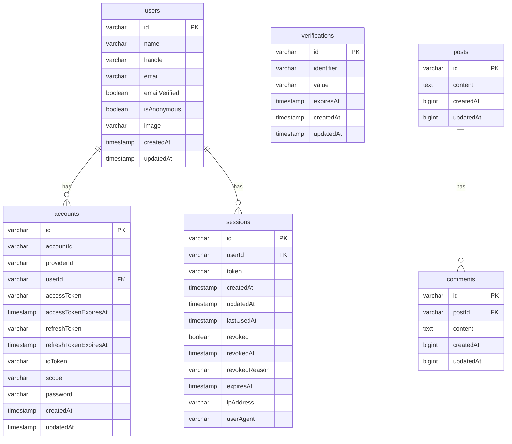

# Database ERD

```mermaid
erDiagram
  users {
    varchar id PK
    varchar name
    varchar handle
    varchar email
    boolean emailVerified
    boolean isAnonymous
    varchar image
    timestamp createdAt
    timestamp updatedAt
  }

  accounts {
    varchar id PK
    varchar accountId
    varchar providerId
    varchar userId FK
    varchar accessToken
    timestamp accessTokenExpiresAt
    varchar refreshToken
    timestamp refreshTokenExpiresAt
    varchar idToken
    varchar scope
    varchar password
    timestamp createdAt
    timestamp updatedAt
  }

  sessions {
    varchar id PK
    varchar userId FK
    varchar token
    timestamp createdAt
    timestamp updatedAt
    timestamp lastUsedAt
    boolean revoked
    timestamp revokedAt
    varchar revokedReason
    timestamp expiresAt
    varchar ipAddress
    varchar userAgent
  }

  verifications {
    varchar id PK
    varchar identifier
    varchar value
    timestamp expiresAt
    timestamp createdAt
    timestamp updatedAt
  }

  posts {
    varchar id PK
    text content
    bigint createdAt
    bigint updatedAt
  }

  comments {
    varchar id PK
    varchar postId FK
    text content
    bigint createdAt
    bigint updatedAt
  }

  users ||--o{ accounts : "has"
  users ||--o{ sessions : "has"
  posts ||--o{ comments : "has"
```
