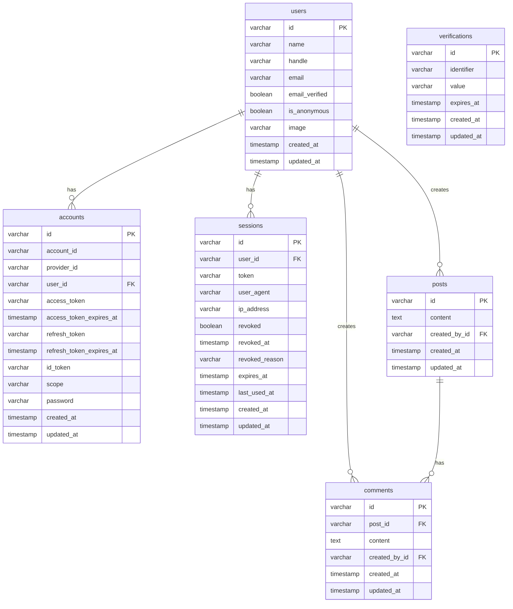

# Database ERD

```mermaid
erDiagram
  %% Auth Module
  users {
    varchar id PK
    varchar name
    varchar handle
    varchar email
    boolean email_verified
    boolean is_anonymous
    varchar image
    timestamp created_at
    timestamp updated_at
  }

  accounts {
    varchar id PK
    varchar account_id
    varchar provider_id
    varchar user_id FK
    varchar access_token
    timestamp access_token_expires_at
    varchar refresh_token
    timestamp refresh_token_expires_at
    varchar id_token
    varchar scope
    varchar password
    timestamp created_at
    timestamp updated_at
  }

  sessions {
    varchar id PK
    varchar user_id FK
    varchar token
    varchar user_agent
    varchar ip_address
    boolean revoked
    timestamp revoked_at
    varchar revoked_reason
    timestamp expires_at
    timestamp last_used_at
    timestamp created_at
    timestamp updated_at
  }

  verifications {
    varchar id PK
    varchar identifier
    varchar value
    timestamp expires_at
    timestamp created_at
    timestamp updated_at
  }

  %% Feeds Module
  posts {
    varchar id PK
    text content
    varchar created_by_id FK
    timestamp created_at
    timestamp updated_at
  }

  comments {
    varchar id PK
    varchar post_id FK
    text content
    varchar created_by_id FK
    timestamp created_at
    timestamp updated_at
  }

  %% Relationships
  users ||--o{ accounts : "has"
  users ||--o{ sessions : "has"
  users ||--o{ posts : "creates"
  users ||--o{ comments : "creates"
  posts ||--o{ comments : "has"
```
